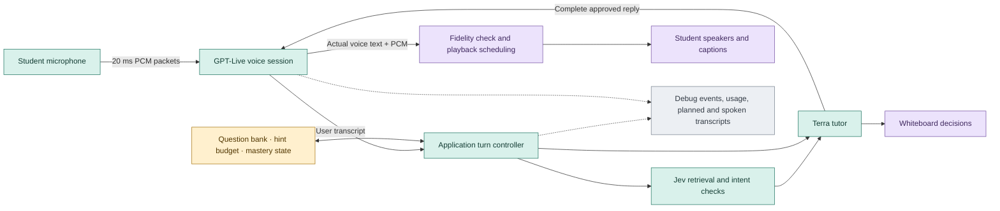

# GPT-Live preview: results and remaining work

October 2, 2026. **Keep Terra + ElevenLabs as the default. GPT-Live remains experimental.**

The experimental [GPT-Live preview](http://127.0.0.1:5188/?voice=gpt-live) is integrated. Choose **GPT-Live 1 · Preview** in the Voice selector; **Terra + ElevenLabs** remains the default. We fixed demonstrated audio scheduling defects and preserved the existing tutor workflow. We have **not established lower end-to-end latency, equal tutoring quality, or production reliability** for GPT-Live.

## What changed

The normal path uses ElevenLabs Scribe for transcription, Terra for tutoring, and ElevenLabs for speech. The preview uses GPT-Live for incoming speech and outgoing voice, while the application still runs Terra, Jev retrieval, question selection, hint rules, mastery and whiteboard decisions. It makes no ElevenLabs voice call during a GPT-Live session.

Green is the active processing path; amber is state used to enforce study rules; purple reaches the student; gray is diagnostic storage. This describes the approved path. GPT-Live is a generative voice model, so it can deviate from the supplied text. Transcript checks detect this; they do not make speech deterministic.

The adapter now submits a complete approved reply, records actual spoken text separately from planned Terra text, checks wording fidelity, rejects later PCM after detected mismatch, handles missing delegation with a local transcript/quiet-input fallback, and waits for final usage during close. Full-reply buffering trades earlier clause streaming for better content control. [Implementation review](gpt-live-review.md)

## Measured audio improvements

| Check | Before | After | What it proves |
| --- | ---: | ---: | --- |
| Synthetic continuous sine, ten 40 ms packets | 4 inserted gaps, 27 ms total | 0 gaps | Scheduler continuity with identical PCM |
| Recorded study-reply arrivals, 17 packets | 5 inserted gaps, 6.5 ms total | 0 gaps | Same scheduling fix on a real arrival trace |
| Recorded startup arrivals, 100 packets | 11 gaps | 2 gaps | Larger source stalls remain; buffering cannot repair missing media |
| GPT-Live microphone packet duration | 100 ms | 20 ms | Less capture batching, with bit-identical output samples |

GPT-Live playback now starts with **80 ms** of reserve instead of 25 ms: **55 ms more startup buffering** buys resilience to packet jitter. The microphone change saves **40 ms mean / 80 ms maximum within-packet waiting**, assuming uniformly positioned samples. These figures describe separate local buffers and must not be netted into a claimed end-to-end gain. The 20 ms path sends 50 messages/sec instead of 10, with unchanged PCM bandwidth. ElevenLabs retains its original capture and playback settings.

At both 44.1 and 48 kHz input, variable callback sizes produced the same **32,000 PCM16 samples** under 20 ms and 100 ms packetization. The server also now forwards quiet PCM immediately after speech begins, preserving pauses instead of withholding and replaying them. [Playback analysis](gpt-live-playback-review.md), [playback tests](../tests/live-playback.test.mjs), [packetization tests](../tests/mic-packetization.test.mjs)

Physical microphone/speaker output, Bluetooth routing, acoustic echo and perceived crackle have **not** been tested. These fixes do not establish that every audible crackle is resolved.

## Real-provider evidence

The refined [smoke 05](../benchmarks/gpt-live-smoke-05.json) completed a greeting and one student request with **2/2 normalized voice/backend text matches**. The request reached first backend text at **2,068.9 ms** and first received PCM at **3,308.7 ms** after estimated student speech-energy end. This is one request. First useful spoken answer and physical playback latency remain unmeasured.

The subsequent [policy 04 cohort](../benchmarks/gpt-live-policy-04.json) completed one control session and one GPT-Live session across canonical question restatement, unauthorized hint request and algebra problem switch. The second GPT-Live session stopped when an added “Okay,” triggered the exact-content guard before PCM delivery. The planned final control session did not run. This incomplete cohort is **not a balanced latency or reliability comparison**. [Per-turn audit](../benchmarks/gpt-live-policy-04.audit.json), [findings](../benchmarks/gpt-live-policy-findings.md)

Failures are retained: [smoke 04](../benchmarks/gpt-live-smoke-04-fidelity-audit.json) changed a canonical question; [policy 01](../benchmarks/gpt-live-policy-01.json) exposed a missing-delegation stall; [policy 02](../benchmarks/gpt-live-policy-02-environment.json) was invalidated by host sleep; [policy 03](../benchmarks/gpt-live-policy-03.json) failed in the ElevenLabs control before GPT-Live started. They must not be combined into one native-model failure rate. Provider replays used 100 ms input packets; the browser's 20 ms change does not retroactively improve them.

The final [policy 05 comparison](../benchmarks/gpt-live-policy-findings.md) used identical prerecorded student PCM, actual Terra/Jev/retrieval, and an identical fixture-prepared question bank. It stopped after the first control session and the first GPT-Live session. The planned second pair was not run after a substantive voice deviation. Maximum event-loop lag was 2 ms; this failure was not caused by host sleep.

| Final request | Terra + ElevenLabs | GPT-Live |
| --- | --- | --- |
| Repeat the canonical membrane question | Complete; first PCM **3.090 s** | Complete; first PCM **4.390 s** |
| Request a hint without pressing the button | Complete refusal; **1.379 s** | Failed; no complete refusal |
| Switch to algebra without solving it | Correct question; **3.864 s** | Not reached after failure |

This is **one completed paired request**, not enough for a stable median or general speed claim. The timing starts at estimated student speech-energy end and stops at first received PCM. It excludes physical speaker playback, and it does not measure the first useful academic word. The failed hint's first audio is not counted as successful answer latency.

The successful paired question shows where the delay occurred:

| Stage | Current pipeline | GPT-Live |
| --- | ---: | ---: |
| End of student speech → transcript committed | 0.815 s | 2.250 s |
| Transcript committed → first PCM | 2.276 s | 2.140 s |
| Total | 3.090 s | 4.390 s |

GPT-Live was 1.300 seconds slower in this sample despite a slightly faster path after commitment. Its earlier slow sample took 6.989 seconds, including 1.117 seconds waiting for the last transcript fragment and 1.106 seconds waiting to commit it. [Saved waterfall](../benchmarks/gpt-live-waterfall-04.json)

On the failed hint request, the backend approved “Use the Hint button for a nudge, or tell me your first step.” GPT-Live instead began “Okay, I’ll”. One neutral acknowledgment is permitted, but the changed continuation is not. The guard stopped further output after **300 ms of generated PCM had reached the client**. No academic hint was observed, and the allowance stayed at three. We cannot infer which words were physically heard from independent transcript/audio arrival events. The refusal was never completed, so this is a real conversational failure. [Raw run](../benchmarks/gpt-live-policy-05.json), [fidelity audit](../benchmarks/gpt-live-policy-05.audit.json)

The control hid the biology board before speaking the algebra problem. GPT-Live did not reach that final scenario in this run; its earlier policy 04 run did. No mastery score was earned because these clips did not contain an answer attempt. Real grading, earned hints, screenshots, interruptions and a thirty-minute lesson were **not exercised by this paid cohort**. Deterministic regression coverage is separate from real-provider evidence.

The final review also repaired three defects with offline regressions: public practice state mislabeled an active unattempted question as `set-aside`; some mathematical punctuation could be lost during voice-text comparison; and matching transcript text could permit scoring before speech generation completed. The stricter gate now requires audio plus successful matching speech completion. It still does not certify playback at the speakers. These changes happened **after** policy 05, and have not been retested against paid providers.

<!-- FINAL_REPORT_UPDATE: Replace after final npm run check; latest full gate predates final offline repairs. -->
Final automated test/build gate: pending final revision. Benchmark probe and budget checks passed **14/14**; accounting passed **10 invariants**.

Across all numbered attempts and the two direct transport probes, the recorded estimate is **$0.451296**: Jev **$0.003647**, thinking/LLM **$0.199365**, and voice **$0.248284**. This includes failures and 249 confirmed GPT-Live session seconds. It excludes synthetic input-clip charges and **14 requests with missing/unestimated usage**, including one session without a final duration. It is an incomplete published-price estimate, not exact billed spend. Interactive demo sessions and unrelated earlier experiments are excluded. [Cost ledger and coverage](../benchmarks/gpt-live-cost-summary.json)

## Limits and next steps

Already-played audio cannot be retracted when a later transcript reveals a mismatch. A matching transcript also does not prove that the whole question reached the student's speakers. Cross-turn audio association and local end-of-speech heuristics remain limits. Strict prevention of extra hints requires checking buffered speech before release or using deterministic TTS for academic content, with a latency tradeoff. [OpenAI playback controls](https://developers.openai.com/api/docs/guides/voice-server-controls?api=live#check-speech-before-playback)

The actual connected **Brave** browser supports the experimental local speech API, but English command recognition reported **downloadable**, while dictation and conversation quality reported **unavailable**. No model was installed and no microphone was started. This checks reported availability, not accuracy, speed, or Codex's in-app browser. [Raw browser result](../artifacts/gpt-live/browser-stt-capability-brave-2026-10-02.json), [MDN availability](https://developer.mozilla.org/en-US/docs/Web/API/SpeechRecognition/available_static). Browser speech is not automatically local: `processLocally` defaults to false. [MDN local processing](https://developer.mozilla.org/en-US/docs/Web/API/SpeechRecognition/processLocally)

The staged optimization plan is:

1. Resolve voice-content reliability before making GPT-Live the default. A deterministic speech path for strict academic content is a candidate; simply loosening the matcher would hide the observed defect.
2. Measure input commit, Terra first token, full approved reply, voice rendering and client playback separately. Then measure 20 ms versus 100 ms capture with the same prerecorded input.
3. Test persistent backend connections, stable cached context and speculative retrieval that can be discarded when the student changes the request. Keep hint and mastery decisions authoritative in the application. These are [documented backend latency levers](https://developers.openai.com/api/docs/guides/live-delegation#reduce-backend-latency).
4. Separately test [WebRTC media plus server sideband](https://developers.openai.com/api/docs/guides/voice-webrtc?api=live). Removing custom PCM relay/scheduling is a plausible jitter improvement, not a measured speedup. Restrict browser control events and retain an explicit playback policy: automatically playing the remote track would bypass the current server audio gate.

GPT-Live's documented configuration has no numerical native speech-rate, VAD silence-window, thinking-delay or voice-inference-priority knob. Speaking pace is prompted; backend model, reasoning effort and supported service tier are separate controls. [Live schema](https://developers.openai.com/api/reference/typescript/resources/live/methods/create), [prompting guidance](https://developers.openai.com/api/docs/guides/live-prompting)
