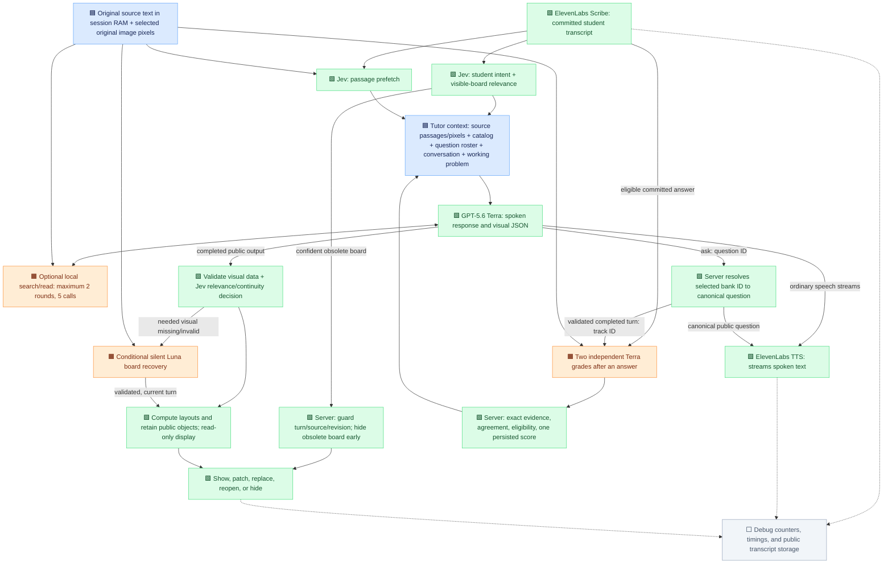
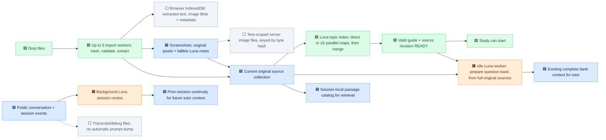

# Live tutor context and retrieval

Implemented October 2, 2026 in the OpenAI live voice transport. The main tutor uses `LUNA_TUTOR_MODEL=gpt-5.6-terra` with low reasoning; background preparation, planning, and separate rendering retain `LUNA_API_MODEL=gpt-6-luna`. Independent grading uses `LUNA_GRADING_MODEL`, which defaults to `gpt-5.6-terra`. Omitting the tutor override restores inheritance from the background model. ElevenLabs still handles speech recognition and synthesis. Question preparation remains outside the indexing readiness gate.

## Active turn

Blue nodes are input data actually used; green nodes perform foreground work; orange nodes run conditionally or in the background; gray is debug/transcript output. The source library is also persisted in browser IndexedDB. Debug logs are not added to the tutor prompt. Selected continuity data derived from earlier sessions is added explicitly as `sessionMemory`.

## Import and background preparation

Question preparation is not a readiness dependency. The optional background teaching planner is disabled in the current configuration; it does not run on every turn. Parallel board generation was benchmarked separately and remains disabled. Speech recognition and synthesis are ElevenLabs services, not additional speaking LLM agents.

## Exact top-level context

| Field | Contents |
| --- | --- |
| `title`, `date`, `difficulty`, `localToday`, `indexStatus`, `testId`, `topics` | Validated test setup. Topics are labels, not independent academic evidence. |
| `materials` | Grouped original excerpts, with source `id`, `name`, and `text`. Normally at most 16,000 excerpt characters, including separators. |
| `materialCatalog` | Source names, IDs, text lengths, chunk counts/first chunk IDs, indexed topic labels, total/omitted counts. Capped at 16,000 serialized characters. |
| `sourceRevision` | Hash of source text, identities, title, topic metadata, and chunk configuration. |
| `retrievalStatus`, `materialCoverage`, `passageReferences` | Selection status and uncertainty; returned/missing evidence counts; exact source/chunk IDs and original offsets. Passage text is not duplicated here. |
| `conversation` | Latest eight public turns, normally at most 8,000 text characters; the latest message is never cut. |
| `conversationMemory` | All earlier public dialogue packed verbatim as indexed role/text tuples. Repeated text may reference an earlier entry. No semantic summary or truncation. |
| `activeQuestion` | Public question ID, topic, difficulty, exact question wording, source IDs, attempts, assistance status. No answer key in this field. |
| `workingProblem` | Public canonical problem retained across narrower scaffolds, with its existing hint and attempt state. It can remain present when `activeQuestion` is null. |
| `encounteredQuestions` | At most 24 previously asked canonical questions from this voice session and source epoch. Public IDs, exact wording and existing attempt/assistance state; no answer keys. Reusing an ID restores its existing quota and attempt identity. |
| `gradingContext` | Whether the latest prompt was canonical and whether the working-problem relationship is confirmed. A substep answer does not automatically count as an attempt at the whole target. |
| `currentProblem` | Latest student/tutor exchange, active-question evidence range, board title/revision/visibility. This anchors context, but newer corrections prevail. |
| `privateQuestionBank` | Complete existing question roster, not relevance-filtered; reference answers masked until a checked attempt permits review. Existing 12,000-character bank-context budget is preserved. |
| `sessionMemory` | Existing prior-session continuity; only exact repeated note/resume copies are removed. |
| `calendarContext`, `readinessContext` | Today's date versus optional exam date; source/index readiness; student intent and context changes. |
| `masteryContext`, `masteryScope`, optional `masteryNotice` | Checked progress and active indexed-topic scope, not academic facts. |
| optional `whiteboardContext` | Current full public board and visibility. The live UI sends no selection. |
| `hintContext` | Current question identity, delivered count, current grant and level, future button availability/cooldown, setup clarification and review permissions. An authorized current hint is still owed even when no future hints remain. |
| optional `turnTask` | Current server event: an authorized Hint-button action or the actual latest student message with bounded feedback permissions. Separates this turn from old dialogue; worked review permission is scoped to one question with a checked correct or incorrect target answer; partial credit alone does not authorize a full solution. No fake student utterance is appended. |
| image input parts | Original selected screenshot pixels, including sources fetched through retrieval tools; derived notes are explicitly fallible. |
| optional `teachingHint` | Existing optional background planner result; planner is disabled in current configuration. |

The recent window is bounded; total retained conversation is deliberately not bounded. Older requests and the context for short replies remain recoverable. Full original history remains available to the grading pipeline. These changes therefore reduce source and instruction repetition, not all long-session growth.

## Retrieval contract

- The current session owns source text and chunk caches. Nothing is uploaded to a vector store. Changes to source revision invalidate working passages and abort old prefetches.
- Prefetch and student-intent classification begin together after a committed transcript. Prefetch has an 850 ms deadline. An obsolete board hides as soon as the intent result arrives, without waiting for prefetch; the main reply still waits for both results. A new turn aborts older work.
- Jev receives up to 20 candidate previews, each at most 800 original characters centered on informative query matches, a bounded public conversation tail, and public active-question wording/source IDs. No private question-bank answers are sent to Jev.
- Selection is useful evidence, not a guarantee of completeness. An uncertain Jev result retains original passages ranked for the current query ahead of stale working passages, without claiming semantic certainty. Source names, whole words, quantities, and single-letter labels help local ranking; no answer is synthesized. Original neighboring chunks are included within budget. Missing pinned sources and omitted requested chunks are disclosed.
- `search_materials({query,sourceIds,sourceRevision})` returns bounded lexical matches. `read_materials({chunkIds,sourceRevision})` reads exact known chunks with neighboring context. Neither can access network, files, or arbitrary code.
- Source-ready returning greetings can also retrieve evidence for a resumed problem; setup greetings without ready sources cannot. Both tools execute only after a completed validated model tool call. At most five calls run across two rounds; the final model continuation has tools disabled. A single deadline and cancellation signal cover the whole turn.
- Streaming speech begins normally when no lookup is needed. Tool requests must precede speech. Mixed speech/tool output is rejected without executing tools; a protocol-violating model preamble may already have streamed before final validation.
- Each model continuation receives its own usage record. Encrypted reasoning state is replayed only to OpenAI to continue a tool response; it never enters speech, public transcripts, or diagnostics.

## Whiteboard and latency

The production board uses the main tutor's visual output. The existing student-intent Jev request also evaluates a currently visible board. A high-confidence obsolete-board signal can hide it before main generation; confirmed help/answer attempts veto that signal, uncertainty keeps the scene, and turn/source/revision/manual-visibility guards reject stale decisions. Set `LUNA_EARLY_BOARD_HIDE=off` to disable this early path. No additional classifier request is added.

TTS overlaps generation. New board delivery follows completed model output, strict validation and the existing scene decision. Missing/invalid visuals can trigger a silent recovery request. No separate speculative board agent is enabled by this change. A recovered drawing of a question already asked in the same turn now preserves that question’s tracking and first-answer eligibility; it cannot revive consumed questions from an earlier turn.

A parallel renderer would need an early public drawing specification from the tutor, containing the current problem, exact dimensions, known values, blanks, and scene action. Starting it only after the current full response cannot remove the existing generation dependency. It also needs turn/source/visibility cancellation and checks that speech and the scene refer to the same problem. A benchmark-only speculative parallel-renderer experiment is documented in `benchmarks/parallel-whiteboard-results.md`. It preserved the requested visuals but was slower in both drawing cases; the separate agent remains disabled in production.

## Natural conversation, strict credit

The interaction is adaptive: the tutor chooses how to explain, respond, scaffold, and switch topics. Unscored follow-ups and ordinary conversation remain free-form. Scored questions come from the prepared bank and use `<ask>question-id</ask>`. The streaming server resolves that ID against the exact bank offered for this turn and the still-current source bank, then sends canonical public wording to TTS and captions. The ID and reference answer are never spoken. This removes a wording-copy task from the model and keeps scoring tied to the actual question delivered. An optional brief spoken statement can precede the question; a useful visual can follow it.

Only a successful current turn consumes the selected bank ID. Unknown, stale, malformed, or multiple references fail closed. A previously encountered canonical question may be revisited only when its snapshotted public wording and current server identity agree; conflicting identities fail closed. A silent visual recovery in the same turn preserves the tracked question. A new source revision or canceled response cannot revive it. Exact canonical wording remains the conservative fallback for legacy non-reference responses; paraphrases do not silently receive credit.

A committed answer classified by Jev is reserved once; uncertain target submissions can receive provisional independent review without consuming an attempt. Two agreed target judgments recognize the attempt, two agreed non-target judgments discard it, and uncertain or conflicting judgments stay pending. Submission order is persisted so unresolved earlier work cannot produce false first-attempt credit later. Recognized attempts are then checked in the background against the original full sources and public conversation, including shown board content. Two independent Terra grades must agree. Server rules enforce question/topic/source identity, evidence matches, first-attempt and assistance eligibility, duplicate prevention, and source revision. Both judgments must cite the original sources, and any alleged assistance must cite eligible public assistant excerpts. Neutral question restatements are not assistance. Delivered Hint exposure is retained across reconnects in the same process and source revision, including regenerated IDs for the same normalized target. The meaning of an answer is still model-evaluated; the credit rules are deterministic, not a claim that semantic grading is infallible.

Graders select server-owned evidence IDs from complete, lossless partitions of the original answer and sources. The server resolves those IDs back to exact original excerpts before strict validation. This removes fragile quote copying while preserving independent correctness and reasoning judgments. Missing, foreign, repeated or altered citations fail closed. The underlying evidence matcher allows only PDF whitespace differences, never changed words, numbers, mathematical signs, punctuation or case. Unsupported `uniqueItems` was removed from the provider JSON schema; the server still rejects duplicate source IDs. Logs record `question.tracked`, `grading.queued`, `grading.started`, `grading.check`, `grading.completed`, `grading.skipped`, and `grading.failed`, including public IDs, decision reasons and eligibility flags. They exclude private answer keys and hidden reasoning.

The board now implements retained scenes. Stable IDs address text, math, rectangles, ellipses, lines, arrows and polylines in one coordinate system. Same-scene patches upsert only named objects and remove explicit IDs. A compact matrix size plus sparse known cells expands to canonical display cells; unspecified cells remain blank. Explicit empty/removal updates clear the board without triggering recovery.

The trusted React/SVG/KaTeX renderer executes no generated HTML or JavaScript. The live board is read-only, with no selection, pan or zoom interactions. Legacy selection validation remains in the server protocol, but the current UI sends no selection. Useful teaching text is allowed across subjects; pure text needs Jev approval, and a duplicated public question alone does not open the board. Shown text remains grading evidence.

Debug events include public scene revisions, show/hide reasons, routing duration, and counts of added/changed/preserved/removed objects. See [the measured step-change report](tutor-step-change-report.md) for controlled comparisons, failures, and test boundaries.
