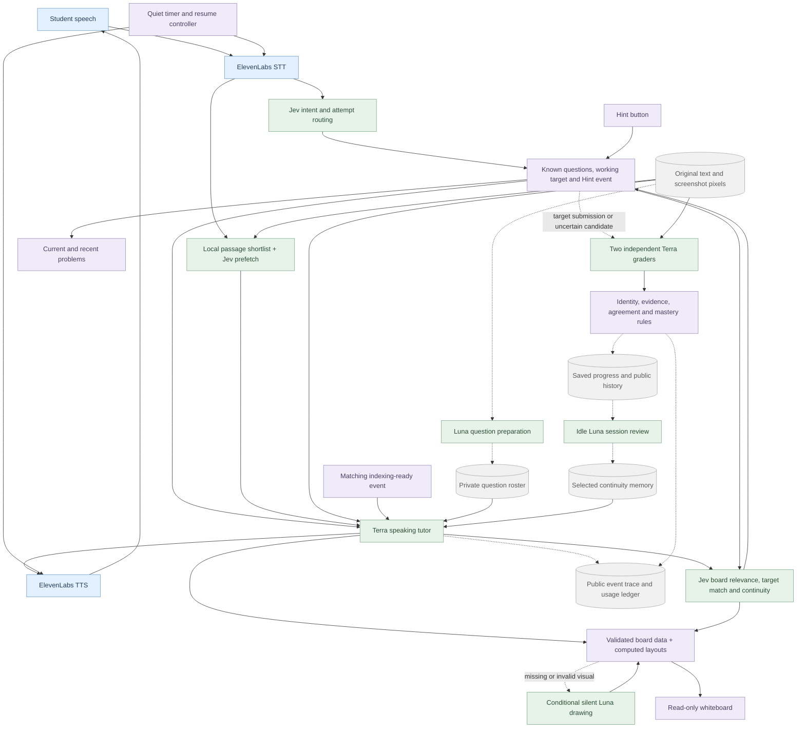

# Tutor quality, continuity and visual rendering

October 2, 2026 · Local Luna Study

This report supersedes the current-state descriptions in the [earlier implementation report](tutor-step-change-report.md). Earlier experiment results remain historical evidence, with their original limitations.

The main change is to separate natural teaching from the responsibilities that software can perform reliably: question identities, hint permissions, source revisions, evidence checks, diagram layout and session timing. The speaking tutor remains GPT-5.6 Terra. GPT-6 Luna handles source preparation and visual recovery. The two independent graders now use GPT-5.6 Terra after a controlled comparison exposed persistent Luna grading errors. Jev makes bounded intent, retrieval and board-relevance judgments.

## Release result

The local demo is running at **[127.0.0.1:5188](http://127.0.0.1:5188/)**. The strongest improvement is a clearer boundary between conversation and authority: the tutor can rephrase, guide and draw, while the server retains the problem identity, hint permission, submitted-attempt order and mastery rules. Better grading is confined to the background; diagram layout is computed by the renderer.

The [final sustained release trial](../benchmarks/tutor-quality/live-adaptive-release.json) used real OpenAI and Jev calls, a scripted student and simulated ElevenLabs on a thirty-minute virtual timeline. It ran academic exchanges through minute 29, with a short pause and resume. Production code hashes matched at the start and end. Correct simulated answers came from the original synthetic fixtures; their “hard” labels deliberately exercise the mastery gate and do not establish real-world question difficulty. [Complete public transcript](../benchmarks/tutor-quality/adaptive-release-transcript.md).

| Final release measurement | Observed result |
| --- | --- |
| Committed student transcript → first text | **1.128 s median**, 25 turns; excludes real STT/TTS |
| Generation start → first text | **1.019 s median**, 27 model turns |
| Completed provider requests | **51 OpenAI + 56 Jev**, all usage recorded; no errors or cap blocks |
| Actually displayed board updates | **13**, replayed in **26 desktop/mobile views** with no browser or math errors |
| Adaptive answers with a missing canonical target | **0** |
| Independent grading | **11 review pairs; 10 accepted grades, 1 dispute withheld** |
| Authorized hints | **3 delivered**; neither answer shortcut revealed the final answer |
| Mastery rules | Three distinct unassisted first attempts on hard-labeled fixture questions earned Equations 100; Cell transport stayed 63/unmastered |
| Estimated API cost for this session | **$0.486700138**, excluding real ElevenLabs and actual billing adjustments |
| Offline release gate | **839 tests passed**, production build passed |
| Final browser checks | **24 general + 18 hint/presence + 12 image-import + 13 gallery checks** |

The specific coaching failures were repaired in the fresh run: partial credit no longer unlocked a full solution; all three Hint clicks delivered their current nudge; wrong-answer feedback invited repair without supplying the final value; the biology restatement added no gradient/energy clues; canonical IDs survived skips, revisits and pause/resume. Correct answers led to another practice action. Three genuine first-answer wins, rather than mere question exposure, triggered equation mastery. The two reviewers agreed the method recap was partial but disagreed about prior assistance, so it received no score. Later teaching feedback was correctly treated as assistance.

All thirteen accepted release boards were replayed on desktop and mobile. Their displayed content matched the active targets; no malformed math, overlapping labels or fragmented prose was found. Wider mobile comparison tables use the advertised native scroll region; row labels move out of view when scrolling right. All 36 cells across the four mobile tables remain reachable with whole words and 16 px text. The final biology table is legible but still sparse and wordy, so this is a readability and correctness result, not a claim that every generated composition is visually polished. [Independent release audit](../benchmarks/tutor-quality/release-independent-audit.md) · [actual accepted-board evidence](../benchmarks/tutor-quality/release-board-audit.json) · [mobile column checks](../benchmarks/tutor-quality/release-matrix-scroll-audit.json).

The [separate planning smoke](../benchmarks/tutor-quality/live-planning-release.json) tested the latest request directly. With no known exam date, the tutor opened: “We can jump into quiz practice. When is your test?” The student did not know and named cell transport as the weak area; the tutor immediately started that tracked question. When further planning was declined, it invited the student to try without asking about timing again. It invented no date and made no grading calls. Three OpenAI and five Jev requests cost an estimated **$0.016311484**.

This is a substantial functional improvement, not a claim of flawless teaching or unchanged cost. Terra grading improved the controlled assistance decisions but is more expensive and slower than Luna grading. The speech path still streamed at about one second to first text in this release trial; it did not beat the earlier 850 ms transcript-to-text checkpoint. Those runs had different outputs and uncontrolled provider/cache conditions, so neither difference establishes causality. The tests do not measure human learning gains or real microphone-to-speaker latency. Closing practice can still become repetitive, and semantic decisions can still disagree.

The sections below retain failed experiments and their corrections so the result can be audited rather than inferred from passing tests alone.

## What is implemented

- The tutor starts substantive work when sources are ready and continues automatically after indexing. It can ask one natural planning question about an unknown exam date or useful priority. Scheduling never gates study, and declined questions should not repeat.
- The Hint button authorizes one incremental nudge. Each canonical problem has three hints, with 45 seconds between them. A cooldown does not refill an exhausted problem. Delivered hints retain both their quota and assisted-attempt status across voice reconnects in the same server process, including regenerated IDs for the same normalized target. Reservations canceled before delivery do not count. Records are source-revision scoped, bounded by a 24-hour expiry and 512-question LRU, and are not persisted across a server restart.
- Sixty seconds of quiet after outstanding speech/work prompts a single “Are you still there?” Another thirty seconds without activity pauses the session. The frosted overlay has an explicit Resume action. Microphone capture and STT stop while paused; resuming retains the working question and remaining hints. The old ten-minute hard limit is now sixty minutes.
- A small Practice sidebar shows the current and recently encountered questions. It does not reveal future bank questions or private answers. Checked results come from the scoring pipeline, not from displaying a board.
- The whiteboard is read-only. Its close icon is centered; selection, pan and zoom controls are removed from the live experience and scripted playground. Mobile controls and Resume remain reachable even when a large board needs scrolling.
- Imports use at most five workers concurrently. Topic indexing becomes ready independently of private question preparation. The tutor receives bounded original passages selected by local search and Jev, with optional source lookup, while retaining the question roster. The earlier three-PDF game-theory benchmark had a 4.461-second median server indexing time after extraction; this is not a drag-to-ready guarantee. [Import and retrieval details](import-and-debug.md).
- PNG, JPEG and WebP screenshots work through drag, picker and paste. Their original pixels reach the tutor, question preparation and both graders. Searchable notes are explicitly labeled model-derived and fallible.
- Flows, numerical plots and text annotations have semantic representations. The model supplies relationships, values and phrases. The renderer computes connectors, axes, tick positions and phrase placement. General retained scenes still cover spatial content beyond these formats.

## The live-session failure that changed the design

The initial live run found a defect that the scripted model doubles did not reveal. The tutor asked a canonical equation question, then naturally rephrased it as “What equal operation would you try first?” The server treated this narrower prompt as a different untracked question. That lost the active identity, disabled every later Hint click and prevented the algebra answers from reaching grading. A later optional date edit also cleared academic state.

The initial run is preserved in [the accounting and behavior audit](../benchmarks/tutor-quality/initial-live-audit.json). The earlier model path made 16 OpenAI and 23 Jev calls; the first revised path made 14 and 24. Neither the lower request count nor its lower estimated cost was an improvement: some work had silently stopped. Its first-text median was also slower, 1.071 seconds versus 0.904 seconds, across differing behaviors. Those runs do not establish a speed win.

The repair separates the working problem and its hint allowance from the latest question eligible for grading. A narrow scaffold should keep the working problem; it must not silently become the full canonical question for credit. Existing semantic decisions determine whether the conversation is still about the same problem. “x = 7” can be an attempted target result even though it is wrong and lacks reasoning; “subtract 3” may answer only a first-step prompt. The classifier identifies which target the student attempted, and the graders judge correctness and completeness. Asking “is that right?” does not discard submitted work.

Exact canonical questions remain server-resolved. A consumed question can now be restated from its existing public identity even after it leaves the upcoming queue; conflicting wording or duplicate queue identities remain unselectable. Its hint quota and attempt record survive the restatement. Uncertain continuity suspends scoring and target-specific hints until the problem is re-established. This preserves conversational flexibility without treating every spontaneous tutor question as a new scored problem.

The first repair run used 19 OpenAI and 30 Jev calls. It retained the equation through scaffolding, delivered three hints, enforced the cooldown and cap, preserved the next question through a date edit, and paused/resumed. Biology reached both graders and received a checked result. Algebra still did not reach grading, despite the correct working identity. The exact original classifier answers were not retained in that run, so the cause cannot be claimed from those artifacts alone. The subsequent repair makes target-level attempts distinct from substep answers and records the normalized intent and grading gate explicitly.

That run also exposed teaching failures: the neutral welcome skipped the optional timing question; a date refusal elicited an unauthorized strategy nudge; and feedback credited a subtraction step the student never stated. These are preserved failures, not a full quality pass. The final coaching and sustained-session results below test the subsequent changes. One final Jev request in the first repair run was blocked before sending by the benchmark's request ceiling; that event is not a production failure.

The next [targeted coaching run](../benchmarks/tutor-quality/live-coaching-repair.json) made 5 OpenAI and 9 Jev calls. It opened with “When is your test, if you know? We can start practicing now either way.” It accepted refusal and started the requested equation, reassured the student about having no calculator without suggesting an operation, withheld a requested solution, and delivered a permitted hint. The earlier invented successful intermediate result did not recur. Median first text was 1.090 seconds across five generated turns, with an estimated cost of $0.033700562. This is a separate targeted sample, not a speed comparison.

Its remaining failure was fully observable: the attempted result “x = 7 … Is that right?” received an attempt score of 0.89 against a 0.90 routing threshold, so no grader ran. That score is not a calibrated accuracy guarantee. The next architectural repair routes uncertain submissions to provisional independent review instead of lowering the threshold to fit this one example. The graders must distinguish an attempted original target from an answer to only a local scaffold; correctness and evidence requirements remain unchanged.

That provisional path is implemented and passes 21 dedicated tests plus a separate [12-case independent review](../benchmarks/tutor-quality/provisional-grading-review.md). Two agreed target judgments recognize an attempt even if its grade remains disputed; a disputed grade earns no score. Two agreed non-target judgments clear the candidate without consuming an attempt. Unknown or conflicting target judgments remain pending. Small persistent records preserve submission order and prevent a later answer or reconnect from manufacturing a first-attempt win. Help delivered after submission does not retroactively make that submission assisted. These reviews run outside the serial spoken-response path.

An unresolved review conservatively blocks first-attempt mastery credit for that same question key until resolved; it does not add an attempt or subtract points. Records are bounded at 1,024 unresolved candidates per test, with a conservative eligibility hold on overflow. This is not automatic replay of interrupted grading after a restart.

The fresh [live provisional checkpoint](../benchmarks/tutor-quality/live-provisional-coaching.json) exercised this path naturally: Jev returned 0.88; both real graders agreed that the wrong result was a target attempt. One called it incorrect and the other partial. Attempt one persisted, the pending marker cleared, and no grade or points were awarded. The optional date question, refusal, neutral calculator reassurance, solution restraint, question identity and hint allowance also held. All 7 OpenAI and 9 Jev calls completed without errors or hitting a cap; estimated cost was $0.034474745. Median generation-to-first-text was 1.469 seconds; committed student transcript to first text was 1.542 seconds across four student turns. Real STT and TTS are excluded.

Teaching wording is improved, not perfect. In that checkpoint the first hint was safe but vague, and the tutor advertised the next Hint button during its cooldown. The UI correctly enforced the timer. The graders' partial-versus-incorrect disagreement is preserved as an unresolved semantic-quality limitation, rather than converted into favorable credit.

## What the sustained half-hour trial exposed

The first [sustained adaptive session](../benchmarks/tutor-quality/adaptive-initial-audit.json) used a 30-minute virtual timeline, with 25 spoken student utterances, three Hint clicks, academic work through minute 29 and one brief pause. The tutor, Jev and both graders were real API calls; the student and ElevenLabs transport were simulated. All 41 OpenAI and 52 Jev requests completed with usage recorded, at an estimated $0.225726005.

It produced seven independent review jobs, six recognized attempts and five accepted scoring events. An actual local-substep submission reached provisional review, both graders rejected it as a target attempt, and it consumed no attempt. A wrong full answer and later correction were tracked as attempts one and two. Neither topic was falsely marked mastered.

This was **not a complete functional pass**. The second authorized Hint click repeated an old calculator acknowledgment. The third incorrectly refused its already-granted hint. After the tutor skipped a canonical question and worked on others, revisiting it lost the public scoring identity; the final eight turns had no active Hint target. Three later response opportunities did not restore it. Visual inspection also found a solution board for the previous equation displayed alongside the newly asked question.

These findings led to three further repairs: a current server Hint event distinct from old dialogue; separate current-grant and future-button state; and a bounded catalog of previously encountered canonical questions. The catalog retains up to 24 encountered questions within the current voice session and source epoch. It carries public identities and exact wording, with the existing attempts and allowance, rather than an answer key. A source change invalidates it; it is not durable question-history recovery after reconnect. A canonical question transition also checks board relevance against that exact new question within the existing Jev request. An uncertain or rejected match keeps the old scene hidden across later turns, until a matching replacement arrives or a confirmed topic departure discards it. Same-question drawing patches retain their fast path. The initial version used a 0.90 threshold; calibration below changes only this display threshold, not grading. It is not proof of visual correctness. Its public context includes matrix dimensions and up to 32 scene object geometries, so blank grids and unlabeled shapes are represented. Subsequent calibration and the final rerun are described below.

One correct source-derived equation explanation received partial judgments from both graders, with disagreement about whether it was assisted. A later explanation with the same reasoning pattern was accepted. No score was awarded to the disputed submission. The subsequent grading instruction explicitly prioritizes the current student answer and uses history only to assess prior help toward that target. The rubric and agreement requirements are unchanged. History contamination is a hypothesis, not a proven cause; the inconsistent initial judgments remain a grading-fairness finding.

The fresh [three-hint replay](../benchmarks/tutor-quality/live-hint-grant-repair.json) delivered all three granted nudges. The second gave a strategy; the third wrote one subtraction step and left simplification to the student. Neither repeated the stale calculator acknowledgment nor refused the current grant. No final target answer was disclosed. An immediate repeat and fourth request made zero provider calls. All 5 OpenAI and 6 Jev calls completed with usage recorded, at an estimated $0.037913860; median generation-to-first-text was 1.016 seconds across five turns. The first orientation hint remained somewhat vague, so this is a functional delivery pass with a wording qualification.

The next [sustained rerun](../benchmarks/tutor-quality/live-adaptive-repaired.json) restored the skipped question and graded the later answer under its existing identity. It delivered all three hints and produced 10 review jobs, eight recognized attempts and seven checked scoring events. Its 50 OpenAI and 55 Jev calls cost an estimated $0.232888703. Median first text was 1.112 seconds across 26 generated turns; committed transcript to first text was 1.278 seconds across 24 student turns, excluding real STT/TTS.

It still was **not a full pass**. The benchmark's 50-call limit blocked a late recovery and the final review before provider fetch. The new 0.90 board-match threshold also suppressed every generated board in the run, including a correct new-question equation with a 0.73 match judgment. Four separate [structural match probes](../benchmarks/tutor-quality/live-board-match-structure.json) confirmed this underactivation: valid blank-grid and unlabeled-triangle candidates received 0.72 and 0.70, while wrong-size and wrong-shape candidates received 0.10 and 0.07. Only the two negative cases met the intended policy decision. This exposed a display-threshold calibration problem; it did not justify weakening grading requirements.

The tutor also supplied the final equation answer while the first wrong attempt was still under review, and one correct-answer response ended in bare praise. The generated worked board was rejected, so only the spoken final value reached the learner. Subsequent coaching changes make the current student event explicit, require repair-first feedback before worked review, and ask for a concrete next learning action. Hint steps are anchored to work the learner actually supplied, not to assumed completion of previous hints. Controlled follow-ups and the complete rerun below assess those changes.

## Completed sustained run and remaining diagnosis

The [completed 30-minute simulation](../benchmarks/tutor-quality/live-adaptive-final.json) reached the final review without errors or a request-cap block: **55 OpenAI and 56 Jev calls**, all with measured usage, estimated **$0.271574814**. It included 25 spoken student turns and three Hint clicks, with 8 actual visible board updates. Median generation-to-first-text was **782 ms across 27 model turns**; committed synthetic student transcript to first text was **850 ms across 25 turns**. Real transcription and ElevenLabs playback are excluded. Different output paths and uncontrolled provider/cache variation mean this is not a causal paired speed claim.

All three granted hints progressed from orientation to strategy to one concrete step. Wrong-answer feedback asked the student to repair their work without giving the final value. Correct-answer feedback led into another canonical question or teach-back. The skipped y and w questions retained their identities when revisited; every adaptive answer found a public tracked target. The closing review prioritized cell transport and explicitly did not infer mastery from having visited the questions. [Exact transcript](../benchmarks/tutor-quality/adaptive-final-transcript.md).

Twelve independent review jobs recognized nine target attempts and produced seven checked scoring events. The app withheld disputed credit and falsely completed neither topic. Audit exposed a narrower fairness defect: the graders marked the first correct w answer as assisted even though only its givens had been shown before it was skipped and restated. The server had correctly queued it as unassisted. The first y answer similarly produced an assistance disagreement. The grading instruction ambiguously included “a prior restatement” in its assistance definition. A neutral repetition must be distinguished from substantive help for the same target across restatements or changed IDs; the controlled repair below evaluates that distinction.

Desktop replay of all eight actually accepted boards was readable and matched the active targets. The biology comparison now used a valid branching flow rather than the earlier malformed table. The mobile audit caught a cropped biology branch. Responsive flow layout now preserves the relationships while narrowing nodes, growing text boxes and reflowing vertically. Replaying all eight accepted boards on both desktop and mobile passes **16 visibility checks**, with no math errors or inaccessible horizontal crop; measured flow labels remain at least 14 px. Larger diagrams have native keyboard-accessible scrolling. [Accepted-board audit](../benchmarks/tutor-quality/final-board-audit.json).

The [16-call restatement experiment](../benchmarks/tutor-quality/grade-restatement-results.json) did **not** establish a repair. With the original instruction, w was classified assisted and y disputed; after explicit clarification, both still received assisted judgments. Four controls for actual same-target hints, help under a changed ID, a worked solution and unrelated teaching behaved as expected. The neutral failures remained in the longer mixed histories. This cost an estimated $0.002994415 with all usage recorded. The subsequent change required explicit citations to the prior assistance actually alleged, allowing the next controlled experiment to inspect the basis for these decisions.

## The grading change supported by controlled evidence

Explicit assistance citations made the error observable. Each independent judgment must now identify the exact eligible public assistant excerpts behind an assisted verdict. Student messages, private answer keys and source documents cannot serve as assistance. The full ordered public history remains available; exact canonical-question-only messages are excluded as help evidence. The server resolves citation IDs and logs their public quotes without recording hidden reasoning.

This alone did **not** repair Luna. In the [12-call citation experiment](../benchmarks/tutor-quality/grade-assistance-evidence-results.json), four of six pairs behaved correctly, but both neutral-restatement cases still failed. One cited a message that combined feedback on a different equation with the new question. The other cited only a neutral introduction and repeated givens. Those failures showed why more confident wording or a cheaper prompt was insufficient.

An [identical six-case Terra comparison](../benchmarks/tutor-quality/grade-assistance-terra-results.md) returned the expected result in **all six pairs / twelve judgments**: neutral repeats stayed unassisted, real hints and worked solutions counted across changed IDs, and unrelated teaching did not count. All assistance evidence resolved to actual public excerpts. The source, history, rubric, schema and low reasoning setting were held fixed; requested and provider-returned model names were recorded.

| Controlled grading cohort | GPT-6 Luna | GPT-5.6 Terra |
| --- | ---: | ---: |
| Expected agreeing pairs | 4/6 | 6/6 |
| Median pair completion | 4.056 s | 5.071 s |
| Estimated cost, 12 requests | $0.00436449 | $0.09644580 |

The evidence supports spending more on the grading task while preserving the fast speaking path. Production now selects Terra **only for independent grading**, with `LUNA_GRADING_MODEL` available as an explicit override. Imports, question preparation, planning and visual recovery remain on Luna. This is a targeted result from one pair per case, not a universal accuracy estimate. Terra was slower and more expensive in this cohort; it is not being described as a free quality gain.

A separate reconnect defect was repaired in deterministic state. Previously, Hint quota could survive while the new session lost the fact that a hint had been delivered. The server now restores delivered exposure before capturing submission eligibility, keyed by the test, source revision and normalized canonical target. Real WebSocket regressions cover the same and regenerated IDs, reused-ID conflicts, canceled grants, changed sources, date edits and hints delivered after an answer. A later hint does not retroactively alter an earlier submission. This retention is process-local and bounded; it does not reconstruct arbitrary past semantic assistance after restart.

## Integrated Terra checkpoint: fairer grading exposed a permission bug

The [first sustained session with production Terra grading](../benchmarks/tutor-quality/live-adaptive-final-verified.json) completed all thirty virtual minutes with **51 OpenAI / 58 Jev requests**, no errors or budget blocks, and unchanged start/end code hashes. All ten review pairs agreed, all adaptive responses retained a canonical target, and three distinct unassisted first-attempt hard answers legitimately earned equation mastery under the fixture rules. Cell transport remained unmastered. Twelve board updates were actually displayed. Median generation-to-first-text was **959.5 ms** and committed student transcript-to-first-text was **1,079 ms**; estimated total cost was **$0.473874821**. These timings are observations of this different path, not a paired speed comparison.

The run also exposed a separate coaching failure. Both graders accepted “apply the same reversible operation” as a partial target attempt, although it did not actually apply an operation or reach a value. A checked partial result then unlocked worked-review permission. When asked for a shortcut, the tutor gave the full x = 4 solution. The earlier request before any attempt was correctly blocked; the later permission rule was too permissive. The complete [transcript](../benchmarks/tutor-quality/adaptive-final-verified-transcript.md) preserves the failure.

The narrow repair separates partial credit from answer disclosure: a checked partial answer may receive local feedback and retain its score, but does not by itself unmask a reference answer or authorize a complete worked solution. A checked correct or incorrect target answer can still receive requested review. This intentionally conservative policy can withhold a complete solution from substantial partial work; incremental feedback and the Hint allowance remain available. It adds no classifier or API hop. The same run also gave biology comparison criteria during a requested restatement. Graders recognized that cue as assistance, preventing an unassisted win, but the response exceeded the requested clarification. The current-turn instruction now limits restatements to the original givens and requested task. The release rerun evaluates both changes; prompt wording alone is not proof of compliance.

## Board relevance calibration

A [fixed 24-scene stress test](../benchmarks/tutor-quality/live-candidate-calibration.json) compared 0.70, 0.85 and 0.90 on the same recorded Jev responses. Three development subjects and three held-out subjects each included one valid target, one wrong target, one mixed old/new scene and one incomplete scene. The selection rule was fixed before calls, and the 0.70 choice was recorded before held-out calls.

At 0.70, each split displayed two of its three valid targets and none of its six wrong/mixed or three incomplete scenes. Across both splits: **4/6 valid scenes displayed, 0/12 wrong/mixed scenes displayed, 6/6 incomplete scenes withheld**. Both higher thresholds displayed zero valid targets. The remaining false negatives were a blank 3×5 grid and an equivalent chemical reaction; their judgments were 0.62 and 0.55. The test does not establish a population error rate or guarantee every helpful board opens.

Production now uses the selected 0.70 display threshold while retaining conservative handling of uncertainty. No new provider hop is added. The existing request makes the target-match judgment, and the grading route remains unchanged. The calibration used 24 Jev calls, zero OpenAI calls and an estimated $0.001264914, with all usage recorded.

## Controlled grading diagnosis

The [twelve-call controlled replay](../benchmarks/tutor-quality/grade-replay-results.md) returned two correct, sufficiently reasoned, unassisted judgments in each of six conditions: the previously disputed z answer with reconstructed, empty or target-only history; and a comparable w answer with reconstructed, empty or swapped prior history. Reconstructed original inputs matched the earlier instruction hash, citation IDs and input-token counts, but the earlier full request bytes were not retained. This is a reconstruction, not a byte-exact replay.

The disagreement did not reproduce with unchanged low reasoning and unchanged grading rules. There is no controlled evidence here that discarding history would help; doing so would remove real assistance evidence. The earlier rejected correct answer remains a semantic-reliability failure. Twelve calls cost an estimated $0.00161428, with all usage recorded. The subsequent [24-call effort comparison](../benchmarks/tutor-quality/grade-effort-results.json) used the same six frozen cases with low and medium reasoning, two independent judgments per case. Low produced the expected checked result in all six pairs, including incomplete, wrong, assisted and non-target controls. Medium produced three agreeing expected pairs and three disagreements, including both complete answers. This small experiment does not prove low is universally more accurate; it gives no basis for making medium the default. Median pair completion was 4.464 seconds at low and 7.733 seconds at medium, outside the speech path. Production remains low, and no disputed score is awarded. The effort experiment cost an estimated $0.006232395 with all usage recorded.

## Visual results and preserved failures

The medium is validated JSON describing teaching content, rendered by trusted React, SVG and KaTeX. Retained scenes remain available for spatial drawings; flow, plot, annotation and matrix blocks give the renderer enough meaning to compute reliable layouts. The earlier [99-call, nine-format comparison](tutor-step-change-report.md#why-this-whiteboard-medium) included HTML/CSS, raw SVG, React/JSX, Canvas, Mermaid, Excalidraw and Vega-Lite. This update builds on that decision rather than asking the speaking model to generate a complete web page for every board.

Ten matched public scenarios used the same Terra model and low reasoning, with alternating before/revised order. They covered hydraulics, biology, chemistry, programming, grammar, history, mechanics, graphs, probability and game theory. This measures the production streaming adapter through validation, not microphone-to-speaker latency.

| Initial matched comparison | Earlier prompt | First revised prompt |
| --- | ---: | ---: |
| Accepted boards | 9/10 | 10/10 |
| Median first spoken text | 899 ms | 857 ms |
| Median generation and validation completion | 3,396 ms | 2,512.5 ms |

Generation completion was 26.0% lower in this small matched set. Schema acceptance did **not** establish visual quality. Browser inspection still found incorrect graph tick placement, clipped flow nodes, connector strokes through captions, repeated grammar text and table prose rendered as algebra.

Those findings led to specific renderer changes:

| Failure | Correction |
| --- | --- |
| Graph numbers guessed as independently positioned labels | Axes, ticks and series share one numerical transform |
| Branch captions obscure the common connector | Layout places captions on the target leg after the branch; paths draw underneath labels and nodes |
| Sentence copied into multiple boxes | Exact phrase spans render the original sentence once |
| Correct nested subject/clause labels rejected | Nested annotations are supported; crossing and duplicate ranges remain invalid |
| Symbol-definition table joins words as TeX variables | Ordinary prose preserves spaces; mathematical cells retain KaTeX |
| Mobile comparison tables squeeze prose into fragments | Prose columns retain readable widths with an explicit, keyboard-accessible native scroll region; numerical grids keep their sizing |
| Raw `\\(…\\)` visible in explanatory text | Explicit inline/display math delimiters render in text and labels |
| Long annotated equation chain clipped before its final value | Safe top-level arrow chains wrap between complete steps at the original readable size |

A later audit of the first Terra-grading checkpoint exposed four mobile biology tables with words broken into tiny fragments. Automated geometry checks alone had missed the problem. The repair uses the existing prose/math classification to give prose columns readable widths and 16 px text, with an explicit native scrolling cue. All four exact tables were checked in the actual **258 px** mobile study frame: all 36 cells retained their contents and were reachable; the 8×10 numerical regression retained all 80 cells at the existing 58 px width. All four desktop comparison screenshots were byte-identical before and after. [Preserved failure and repaired evidence](../benchmarks/tutor-quality/verified-independent-audit.md) · [full-app checks](../artifacts/hint-presence/results.json).

The later long-chain fix was replayed on the exact previously rejected w candidate at desktop and mobile widths. Six rendered cases pass visibility checks; the complete final value remains readable. Original TeX slices are preserved, and only safe top-level implication arrows gain wrapping opportunities. Nested environments, scoped formatting and indivisible formulas retain their original rendering. This validates a renderer repair, not evidence that the earlier candidate was shown live. [Desktop/mobile evidence](../benchmarks/tutor-quality/equation-wrap-verification.json).

Follow-up cohorts are separate from the matched comparison. The first eight follow-up calls accepted 7/8 boards. Four diagnostic grammar calls accepted 3/4 and exposed the nested-span rejection. Replaying all four immutable outputs after the repair accepted 4/4, without a new model call. The final four fresh calls accepted 4/4: a hydraulic symbol table, a branching decision, nested grammar annotations and a sampled smooth plot. Their median first text was 845 ms and completion 1,748.5 ms; those different scenarios and follow-ups are not a paired speed comparison.

The independent final visual audit selected the latest outputs for the ten original subjects: nine passed the specified visual/content checks; the parabola was qualified. Its supplied points and numerical ticks are exact, and shape-preserving interpolation makes it smooth without adding intervening extrema. It does not symbolically evaluate the equation between points. General free-positioned scenes can still have layout errors.

Evidence: [all cohort statistics](../benchmarks/tutor-quality/boards-summary.json), [independent visual audit](../benchmarks/tutor-quality/independent-visual-audit.md), [final browser checks](../benchmarks/tutor-quality/boards-final-browser.json). The inspection uses the current renderer for both saved earlier and revised outputs; it is not a frozen historical-browser comparison.

## Screenshot evidence

A seven-request live test used three generated hydraulic-symbol screenshots, encoded as PNG, JPEG and WebP. All six checks passed.

| Measurement | Result |
| --- | ---: |
| Read all three images concurrently | 2.802 s |
| Index that image collection afterward | 3.071 s |
| Tutor first text when derived notes were deliberately wrong | 1.034 s |
| Independent grading with deliberately wrong notes **and** reference answer | Both graders used the original pixels; checked correct/unassisted |

Those seven requests used the earlier Luna graders. A [fresh two-call test of the production Terra grading route](../benchmarks/screenshot-vision/image-grading-terra-results.json) also passed: both judgments identified Q as volume flow rate from the original PNG despite contradictory notes and a wrong reference. It used 5,718 input and 334 output tokens, costing an estimated $0.0117312. This is one clear synthetic image, not a broad screenshot-accuracy estimate.

That is approximately 5.87 seconds for reading plus indexing these small fixtures, excluding browser transfer. It is not a ten-second guarantee for arbitrary files. PDFs still use extracted text; their diagrams do not automatically become image inputs. Scanned PDF OCR and animated-image imports remain unsupported.

Original screenshot files live under the test-scoped server image store with byte-hash identities; the browser also retains their Blob for previews. Dev and production tests verify that the import POST reaches the handler and private image/data paths are not served as static assets. Old image files do not yet have automatic garbage collection. [Full screenshot results](../benchmarks/screenshot-vision/results.json) · [exact import, storage and retrieval structure](import-and-debug.md).

## Current architecture

Blue is speech transport, green is model work used during teaching, purple is deterministic application behavior, and gray is storage. Dashed connections are background or persistence work.

The optional teaching planner and speculative parallel board agent are disabled. Conditional visual recovery and idle session review remain separate model work. There is no extra serial model call just to grant hints, schedule a check-in, verify a canonical board transition or draw axes. The voice tutor still streams speech before board completion. Reference answers for unattempted questions are masked, while the existing question roster remains available. Ordinary retrieval remains bounded local passages with optional local search/read tools; screenshots attach original image input, not just a generated summary.

Strict mastery means checked source evidence, current identities, two agreeing grades, first-attempt/assistance rules and distinct hard-question wins. It does not mean the language model’s semantic judgments are infallible. A rejected or disputed grade awards no credit.

The working-problem repair covers canonical question-bank practice. A new freeform teaching question without a bank identity is not automatically scored and does not acquire a Hint quota. The tutor can discuss material freely, but must return to a tracked question for assessed practice. There is no claim of universal freeform problem tracking or a perfect semantic spoiler detector.

## Validation and limits

Virtual-clock simulations exercise the production session loop, question bank, progress store and timing, with explicit simulated students, model responses and ElevenLabs transport. The earlier scenarios run to minute 30 but concentrate academic turns earlier and include a long absence; they are not continuous half-hour learning sessions. A separate sustained scenario has 30 interactions spread through the half-hour, academic work through minute 29, and a brief pause. It includes wrong answers, retries, assistance, topic changes and checked scoring. These are accelerated time simulations, not thirty minutes of real human learning or real ElevenLabs audio.

The live comparison and its repair use actual OpenAI/Jev decisions with simulated audio and fixed academic questions to isolate teaching behavior. Real model usage is recorded separately from fake voice events. Fixed question preparation removes question-generator variability; both graders run against the original sources in the live arms.

The final full offline gate passes **839 automated tests and a production build**. Independent checks also pass 16 transition cases and 12 provisional-grading cases. Browser evidence includes 24 broad interface checks, 18 hint/presence checks, 12 screenshot-import checks, 9 read-only playground checks and a 13-example actual-output gallery. The broad interface test was updated to assert that legacy zone data has no interactive targets and clicks/keyboard send no selection packets; it also passes imports, automatic indexing, date and scene persistence, captions and mobile layout. The close icon had zero measured center offset inside its target on both desktop and mobile. The general, hint/presence, screenshot and gallery suites were checked again after restarting the final localhost server. [Release validation evidence](../artifacts/teaching-quality/release-validation.json) · [localhost status and route checks](../artifacts/teaching-quality/localhost-verification.json). The existing large-bundle advisory remains.

The 36 visual-model requests have fully reported token usage, with a public-rate estimate of $0.1638961. The failed first live session comparison cost an estimated $0.157936274 for 30 OpenAI and 47 Jev calls. The [cost summary](../benchmarks/tutor-quality/cost-summary.json) separately accounts for source-image experiments and each live repair, including failures, with hashes of its input artifacts and separate LLM/Jev estimates. The final listed quality experiments, including failed runs and the image/planning checks, total **438 OpenAI + 411 Jev calls**, with complete observed usage: **$2.350730900 LLM + $0.027056946 Jev = $2.377787846 estimated**. These are experiment subtotals, not an invoice or the total cost of this development conversation. Earlier format/model/voice benchmarks are outside this explicitly enumerated subtotal. The app’s per-test debug view continues to split Jev, Thinking/LLM and Voice, with missing/partial data explicitly labeled.

## Try it locally

- [Live tutor](http://127.0.0.1:5188/): import materials or screenshots, start a session, practice, request a hint, and pause/resume.
- [Actual-output teaching lab](http://127.0.0.1:5188/quality-demo.html): inspect earlier and revised model outputs across thirteen examples, including the recovered nested-annotation failure and the long-equation renderer repair. No paid calls or microphone.
- [Scripted board playground](http://127.0.0.1:5188/board-demo.html): same read-only renderer with external controls for steps, notes, replacement and hide/reopen.

All changes are local to Luna Study. The CUPI website is unchanged.
